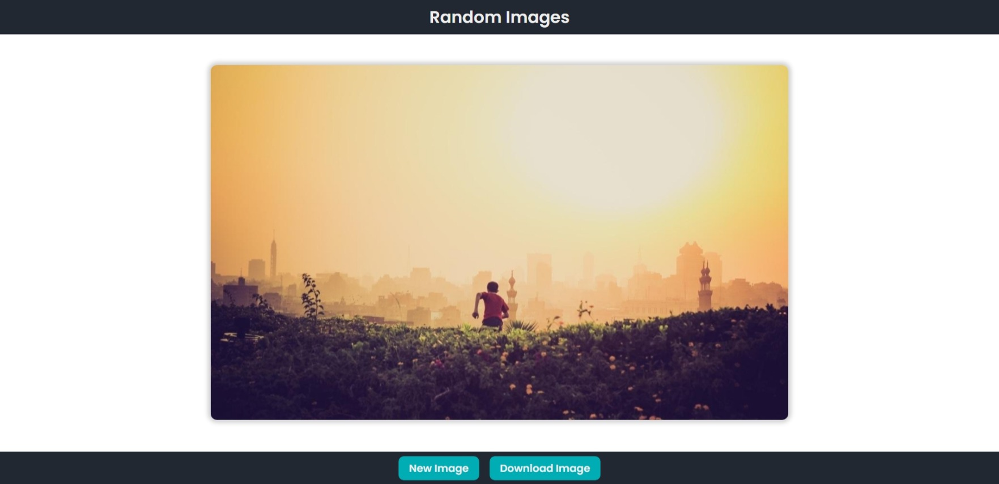
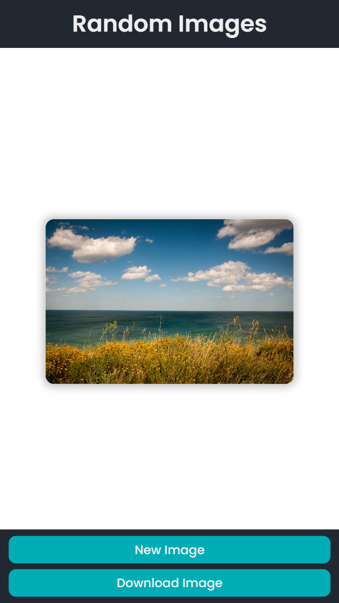

# Random Image Generator

I Created this [Random Image Generator](https://withmohitjoshi.github.io/login-signup-ui/) where you'll get random images and if you like any image you can download it too.

- [Random Image Generator](#random-image-generator)
    - [Links](#links)
    - [Screenshot](#screenshot)
    - [Built with](#built-with)
    - [Api Used](#api-used)
    - [Author](#author)
    - [Other Projects](#other-projects)

### Links

- Live Site URL: [Random Image Generator](https://withmohitjoshi.github.io/random-image-generator/)
- Gthub Repo: [random-image-generator](https://github.com/withmohitjoshi/random-image-generator)
 

### Screenshot

### Built with

- ReactJs
- axios
- HTML5 & JSX
- CSS3 custom properties

### Api Used
 - [Lorem Picsum](https://picsum.photos)

### Author

- Github [@withmohitjoshi](https://github.com/withmohitjoshi/About-Me)
- LinkedIn [@withmohitjoshi](https://www.linkedin.com/in/withmohitjoshi)

### Other Projects
[Projects Links](https://github.com/withmohitjoshi/Projects-Links)
